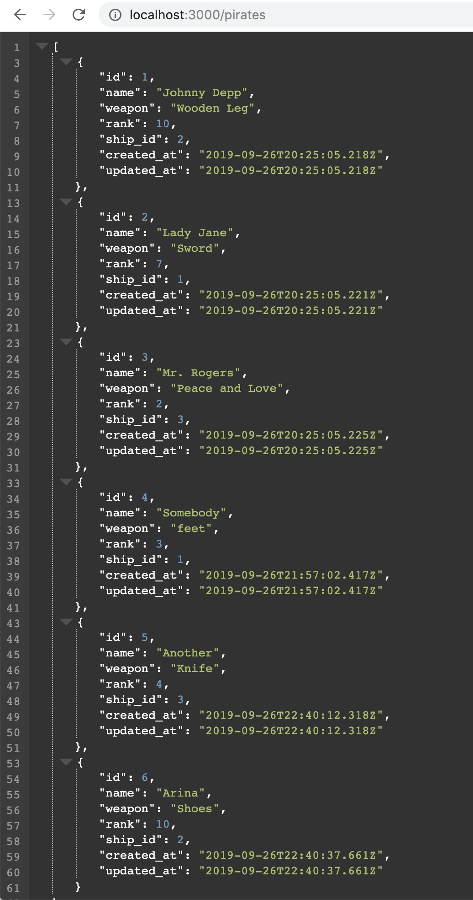
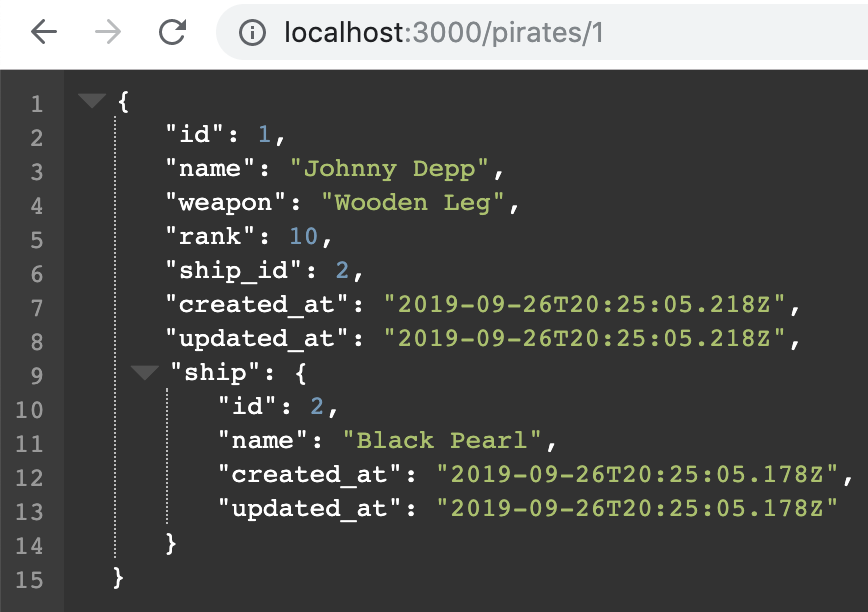

# Rails API WarmUp

1. With a model of your choice create a Rails API with a resource that lists at least 10 seeded data entries. 
  > Deliverable: Slack a screenshot of the resource in the browser. 
  
  *Ex:*  
  
2. Create a resource that shows one data set at a time. 
  > Deliverable: Slack a screenshot of the resource in the browser. 
  
  *Ex:*  

