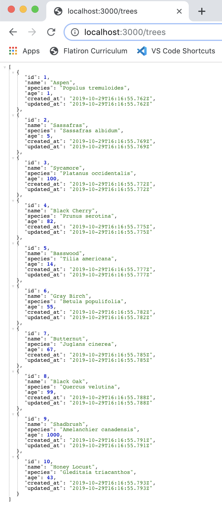

# Rails API WarmUp

**FORK and CLONE this repo**

 - When the following tasks are completed commit and push your code to github and slack Damon the url.
 - Replace the example photos in the ReadMe with screenshots of your own.
 
## Tasks

1. With a model of your choice create a Rails API with a resource that lists at least 10 seeded data entries. 
  > Deliverable: Commit and push code to github and slack me the url. 
  
2. Stretch: Create a resource that shows one data set at a time. 
  > Deliverable: Commit and push code to github and slack me the url.  
  
  *Example 1:* 
  
  *Example 2:* 

